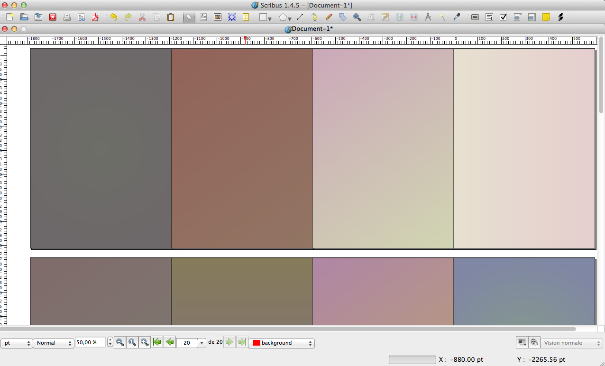

# Background Gradient

A python script for Scribus to generate a random background gradient.

#Demo

# License

[GNU General Public License](https://gnu.org/licenses/gpl.html)

# TO DO
- Put the backgound layer in background