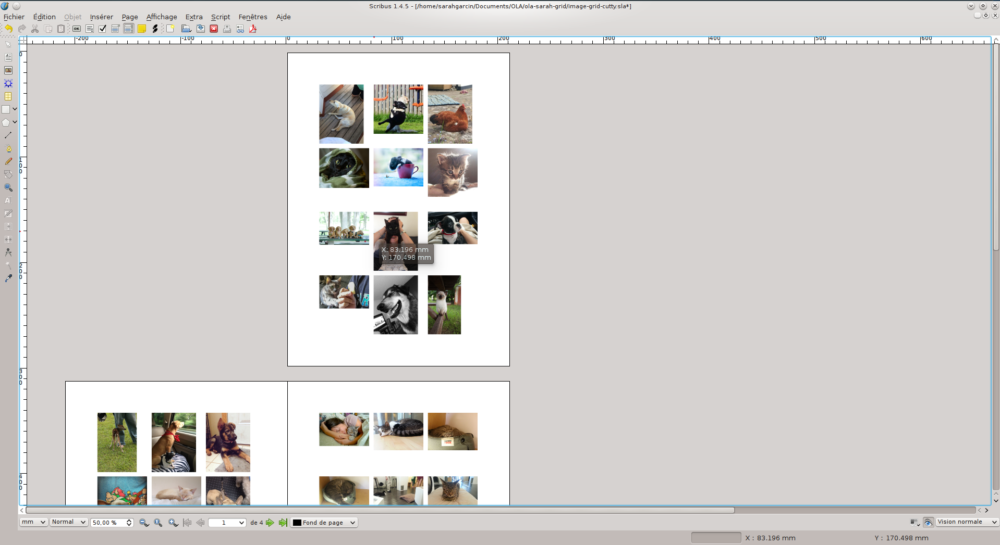

#Image Grid

A python script for Scribus to create image grid. The script creates a new Document and import in a grid your images. You can choose the document format, the number of columns and rows.

#Demo

# How to use it

1. Clone or download this repository
2. Go in Scribus, go to `Script > Execute Script…` and select `image-grid.py`
3. Change the values in dialog windows

# License

[GNU General Public License](https://gnu.org/licenses/gpl.html)