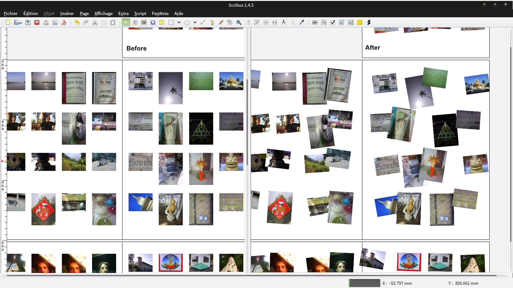

# Magnetude

A simple python script for [Scribus](http://scribus.net) to generate an earthquake effect on one or all the pages of a document. Basically it rotates and moves blocks around according to a magnetude number chosen from 1 to 10.

# Demo

# How to use it

1. Clone or download this repository
2. Open a new or existing document in Scribus, go to `Script > Execute Script…` and select `magnetude.py`

# License

[GNU General Public License](https://gnu.org/licenses/gpl.html)
