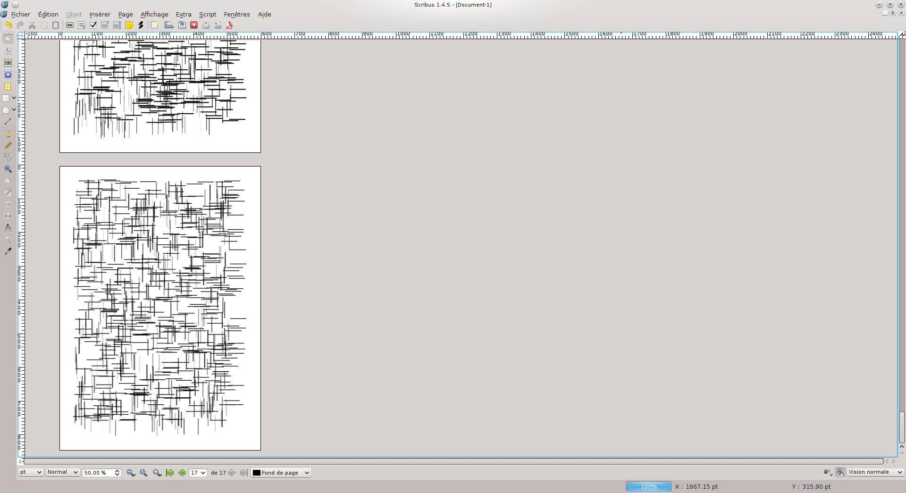

#Mondrian

A python script for Scribus to create image like Mondrian drawings

#Demo

# How to use it

1. Clone or download this repository
2. Go in Scribus, go to `Script > Execute Script…` and select `mondrian.py`

# License

[GNU General Public License](https://gnu.org/licenses/gpl.html)