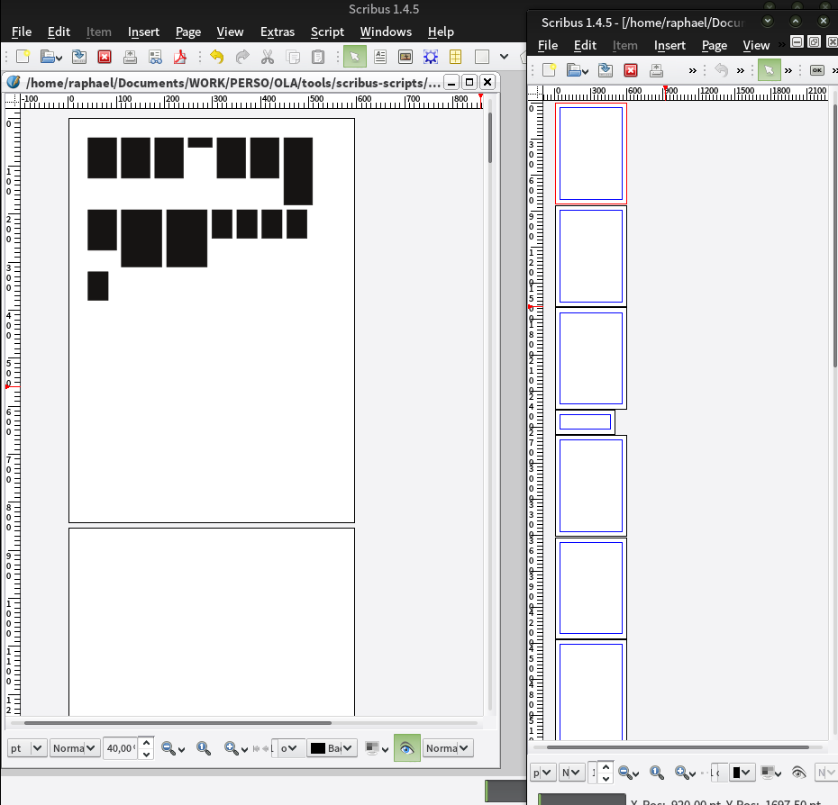

# Page Index

A simple python script for [Scribus](http://scribus.net) to make a graphical index of the document’s pages.

# Demo

# How to use it

1. Clone or download this repository
2. Select a page where you want the index to be created
3. Open a new or existing document in Scribus, go to `Script > Execute Script…` and select `page-index.py`

# License

[GNU General Public License](https://gnu.org/licenses/gpl.html)
