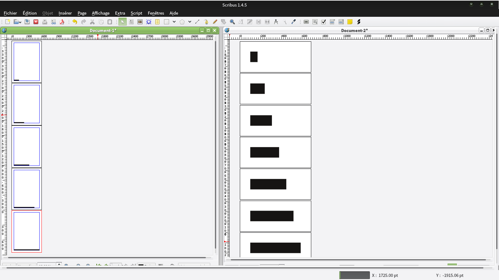

# Progress Paginate

A simple python script for [Scribus](http://scribus.net) to produce a progress-bar like pagination.

By default, the pagination bars will be drawn inside the pages’s margins at the bottom left of each pages.

# Demo

# How to use it

1. Clone or download this repository
2. Open a new or existing document in Scribus, go to `Script > Execute Script…` and select `progress-paginate.py`
3. Enjoy the power of printed progress bars!

# License

[GNU General Public License](https://gnu.org/licenses/gpl.html)
