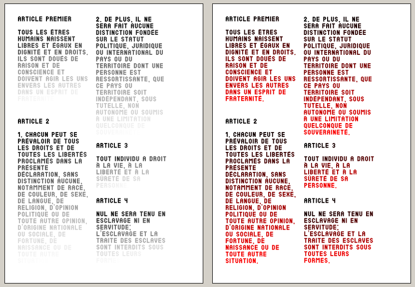

#	Text gradient

A python script for Scribus to create text gradients.

##	License

GNU General Public License

##	Demo

##	How to use

*	Create two colors in scribus, named start and stop.
*	Select the TextFrame objects on which you want the script to be applied (other object types will be ignored).
*	Run the script.

##	Issues

*	Currently, if you use the script on a multi-block text, the gradient will not be applied on each block individually, but on the whole text. This is due to the comportement of the getTextLength() and selectText() functions of the Scribus API. Even though these function take a TextFrame name as an argument, they will not apply on the textFrame itself but on the whole text they share. This also lead to an useless repetition of the gradient application.

##	Todo list

*	Add more gradient function and/or selection functions !
*	Add multiple gradients loops
*	Add middle color option
*	Create an interface ?